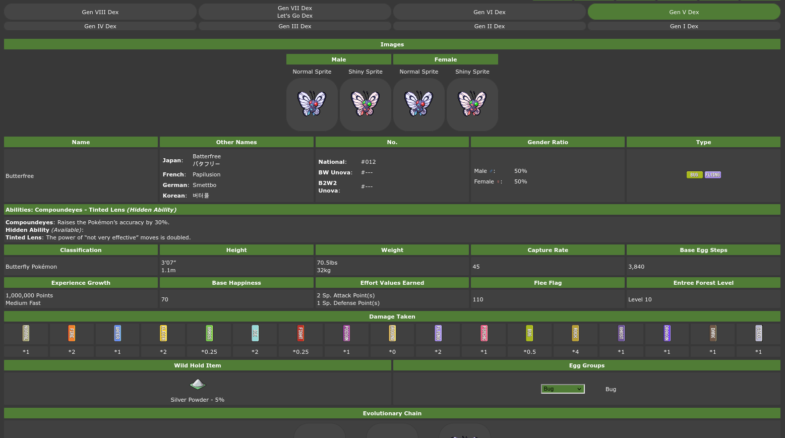

# Description
The goal of this project is to generate a complete set of pokemon data usable by applications from reliable human-readable wikis such as [Serebii](https://www.serebii.net/) and [Bulbapedia](https://bulbapedia.bulbagarden.net/wiki/Main_Page) in JSON format. Additioanlly, the generated JSON files should be usable for importing into NOSQL databases such as [MongoDB](https://www.mongodb.com/). This project is still in development.
# Installation
Clone the git repository, and refer to requirements.txt. It is recommended that the user use a [virtual enviornment](https://docs.python.org/3/library/venv.html). The project was created using python version 3.11.7.
# Usage
## Running Scripts
In the python environment of your choosing, execute any of the following .py files with the listed arguments: 
pokedex_scraper.py  
## Using the output files
### pokedex_data.json
The data is structured such that each pokemon generation contains a sub dictionary of each pokemon which exists in that generation, as its data exists for that generation. For example, pikachu will be in every generation, while scrafty will only be found starting from gen 5. The various statistic categories on the corresponding serebii page will be searched for, based on the standard structure the wbpage tends to follow. 
 
For example, in the above generation 5 pokdex page for butterfree, the english name under the "Name" category would be saved as "Name (english)" and the gender ratio for males would be saved under "Male Ratio".  
# Features
- Stores scraped data into JSON format
- Scrapes serebii for pokedex information for all pokemon up to generation 5.
# Planned Features and Improvements
- Bugfixes for generation 1 - 5 serebii scraper scripts
- JSON File verification for easily identifiable problems in large files
- Automatic checking of robots.txt for target sites
- Support for the serebii attackdex
- Support for the serebii abilitydex
- Support for the serebii itemdex
- Support for the bulbapedia archive for game sprites
- Support for generations up to the present
- Arguments for defining specific target data, such as a range of national pokedex numbers, or excluding particular information